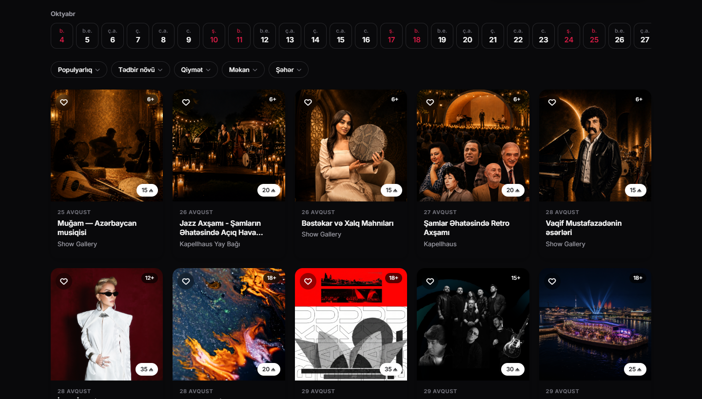

<!-- Every image links only to my own site, repos or demos -->

<a href="https://saidmuradkhan.dev">
  
</a>

<p align="center">
  <a href="https://saidmuradkhan.dev">
    
  </a>
</p>

<p align="center">
  <a href="https://saidmuradkhan.dev"></a>
  <a href="mailto:saidmuradkhan414@gmail.com"></a>
  <a href="https://instagram.com/muradkhansaid"></a>
</p>

---

## 👨‍💻 About me

```jsx
const Said = () => (
  <Developer
    role="Frontend Developer"
    location="Baku, Azerbaijan 🇦🇿"
    work={["Leops", "Assetra"]}
    loves={["clean UI", "smooth animations", "responsive layouts", "component design"]}
    currentlyLearning="advanced TypeScript & performance"
  />
);
```

## 🛠️ Tech stack

<p align="center"><b>Frontend</b></p>
<p align="center">
  <a href="#"></a>
</p>
<p align="center"><b>Backend</b></p>
<p align="center">
  <a href="#"></a>
</p>
<p align="center"><b>Tools</b></p>
<p align="center">
  <a href="#"></a>
</p>

## ✨ Showcase

<table>
  <tr>
    <td align="center" width="33%">
      <a href="https://saidmuradkhan.dev"></a>
      <br/><b>Portfolio</b><br/><sub>React · Vite · Lenis smooth scroll</sub>
    </td>
    <td align="center" width="33%">
      <a href="https://github.com/saidmuradkhan/Iticket"></a>
      <br/><b>iTicket</b><br/><sub>Dark mode · events · interactive seat map</sub>
    </td>
    <td align="center" width="33%">
      <a href="https://carify-theta.vercel.app"></a>
      <br/><b>Carify</b><br/><sub>Multi-language · customs calculator</sub>
    </td>
  </tr>
</table>

## 🚀 Projects

<p align="center">
  <a href="https://github.com/saidmuradkhan/ecommerce"></a>
  <a href="https://github.com/saidmuradkhan/Iticket"></a>
  <a href="https://github.com/saidmuradkhan/Carify"></a>
  <a href="https://github.com/saidmuradkhan/cocktail"></a>
</p>

<p align="center">
  <b>Live demos:</b>
  <a href="https://saidmuradkhan.dev">Portfolio</a> ·
  <a href="https://carify-theta.vercel.app">Carify</a> ·
  <a href="https://cocktail-said-6990.vercel.app">Amber Lounge</a> ·
  <a href="https://ecommerce-said-6990.vercel.app">E-commerce</a>
</p>

## 📊 GitHub stats

<p align="center">
  <a href="https://github.com/saidmuradkhan?tab=repositories"></a>
  <a href="https://github.com/saidmuradkhan?tab=repositories"></a>
</p>

<p align="center">
  <a href="https://github.com/saidmuradkhan"></a>
</p>

<p align="center">
  <a href="#">
    <picture>
      <source media="(prefers-color-scheme: dark)" srcset="https://raw.githubusercontent.com/saidmuradkhan/saidmuradkhan/output/github-snake-dark.svg" />
      
    </picture>
  </a>
</p>

<a href="https://saidmuradkhan.dev">
  
</a>
